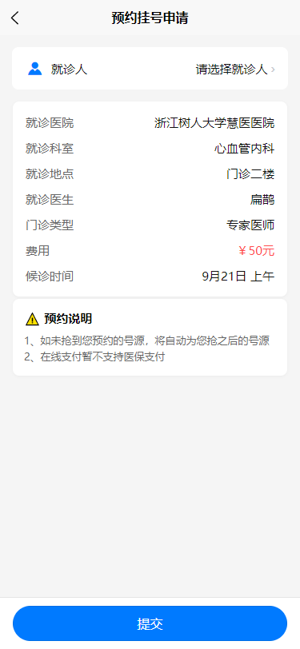
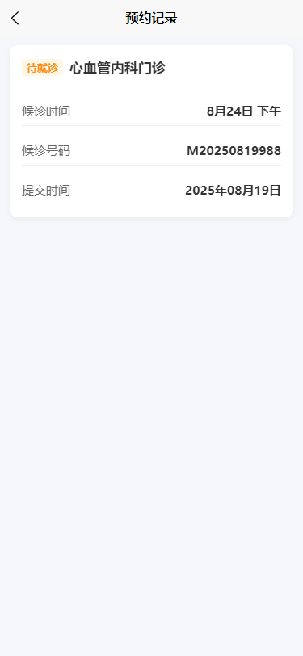
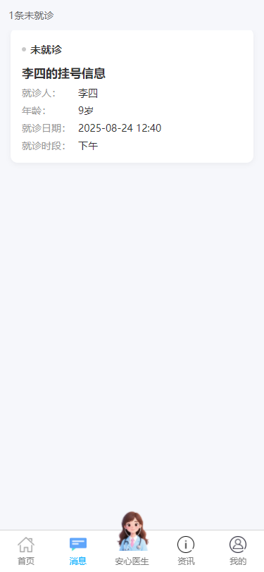
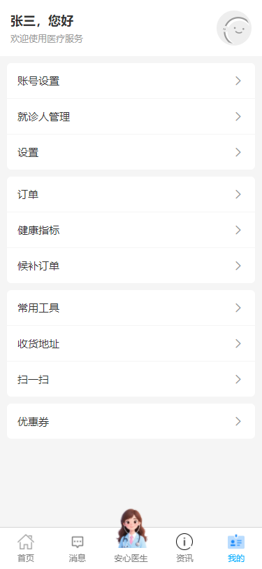

# 智能医院挂号系统用户前端

### 介绍
本项目是「智能医院挂号系统」的用户网页端。基于 uni-app + Vue3 + Vite 构建，一套代码同时支持微信小程序与 H5，提供在线预约挂号、智能导诊、就诊人管理、订单查询等完整流程。

智能挂号项目分别放在三个代码仓库：

1.用户端网页代码仓库：
https://gitee.com/garveyer/intelligent-registration-user-front

2.管理员端网页代码仓库：
https://gitee.com/garveyer/intelligent-registration-admin-front

3.后端代码仓库：
https://gitee.com/garveyer/IntelligentRegistrationBack

### 项目特色

- 🚀 跨平台支持（微信小程序/H5）
- 💡 智能导诊AI推荐
- 📱 完整的挂号流程
- 🎨 现代化UI设计

### 软件架构

- 前端：uni-app + Vue3 + TypeScript + Vite
- UI 组件：uview-plus
- 网络：集中封装 tools/request/request.js，统一超时、错误提示、Token 拦截
- 状态：Vuex 模块化存储用户、就诊人、当前订单信息
- 跨端：编译输出微信小程序、H5（其他端可按需扩展）

### 快速开始

#### 环境要求


- Node.js ≥ 14
- pnpm/npm/yarn

#### 安装依赖

```
pnpm install
```

#### 开发运行

```
# 微信小程序
pnpm dev:mp-weixin

# H5
pnpm dev:h5
```

#### 生产构建

```
# 微信小程序
pnpm build:mp-weixin

# H5
pnpm build:h5
```

### 核心功能

| 功能模块  | 状态 | 描述        |
| ----- | -- | --------- |
| 首页    | ✅  | 轮播图、快捷入口  |
| 预约挂号  | ✅  | 科室选择、医生排班 |
| 智能导诊  | ✅  | AI症状推荐科室  |
| 就诊人管理 | ✅  | 添加/编辑就诊人  |
| 订单管理  | ✅  | 预约记录、取消预约 |
| 个人中心  | ✅  | 用户信息、设置   |

### 项目结构


### 页面展示
## 全页面一览

| 功能模块 | 页面路径 | 文件名约定 | 预览 |
|---|---|---|---|
| 首页 | pages/index/index | `index.png` |  |
| 科室列表 | pages/index/secondVue/departmentList | `department.png` |  |
| 医生排班 | pages/index/secondVue/doctoList | `doctor-schedule.png` |  |
| 挂号申请 | pages/index/secondVue/registrationApplication | `registration-application.png` |  |
| 挂号成功 | pages/index/secondVue/registerSuccess | `register-success.png` |  |
| 预约记录 | pages/index/secondVue/appointment | `appointment.png` |  |
| 就诊人列表 | pages/index/secondVue/medicalVisitInformation | `patient-management.png` |  |
| 添加就诊人 | pages/index/secondVue/addPatienter | `add-patient.png` |  |
| 智能导诊 | pages/index/chat | `ai-diagnosis.png` |  |
| 消息中心 | pages/index/message | `message.png` |  |
| 资讯页 | pages/index/infor | `information.png` |  |
| 个人中心 | pages/index/my | `my.png` |  |
| 账号设置 | pages/index/my/accountSettings | `account-settings.png` |  |
| 服务空白页 | pages/index/noService | `no-service.png` |  |

> 截图存放路径：**`docs/assets/`**，命名务必与上表一致，推送后即自动加载。

### 开发规范


- 遵循Vue3 Composition API
- 使用TypeScript进行类型检查
- 统一代码格式化配置
- 组件命名采用PascalCase
- 页面文件使用小写+连字符

### 版本历史

- v1.0.0 - 基础功能完成

    1. 用户登录/注册
    2. 预约挂号流程
    3. 就诊人管理
    4. 订单管理


### 致谢
感谢所有贡献者的支持！

⭐ 如果这个项目对您有帮助，请给个Star支持一下！
